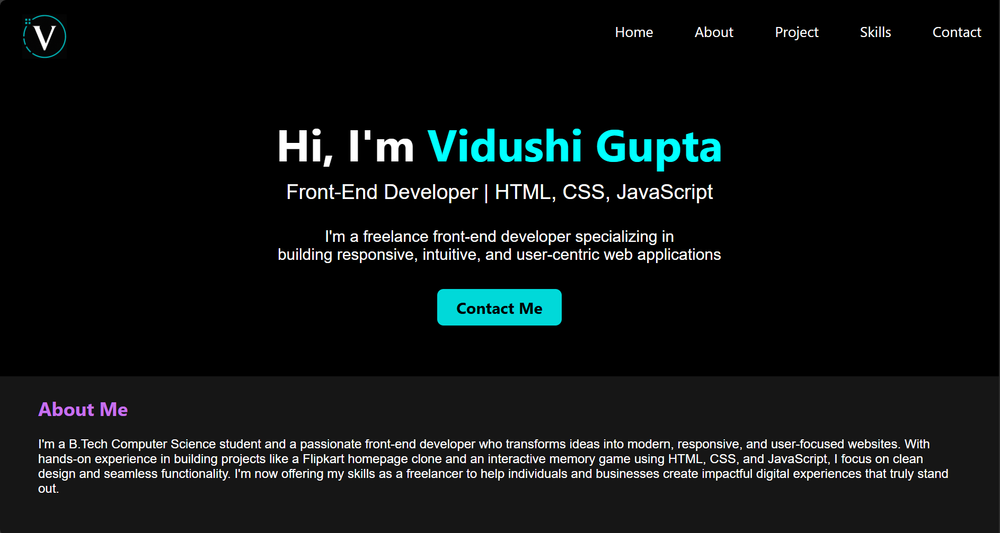
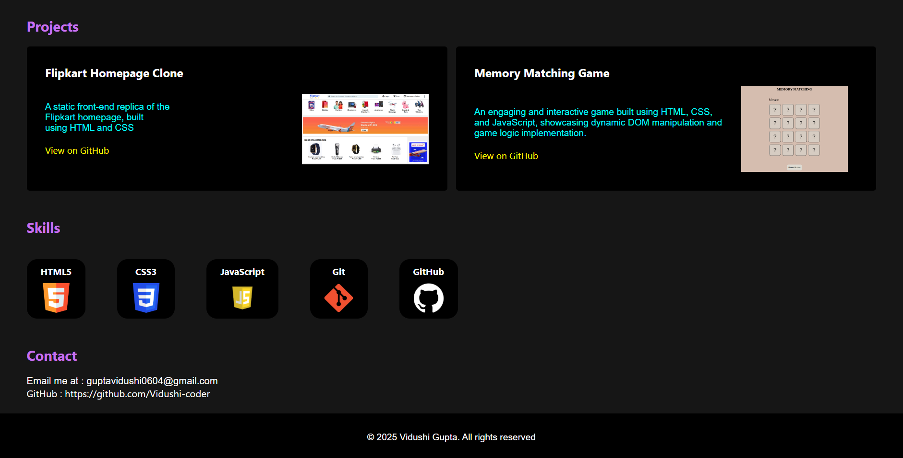

# 📌 Portfolio Website

This is a personal portfolio website created using **HTML** and **CSS** to showcase my web development projects, skills, and contact information.

---

## 🖥️ Live Demo

👉 [Click here to view the website](https://vidushi-coder.github.io/Portfolio/portfolio.html)  

---

## 🛠️ Technologies Used

- HTML5  
- CSS3  
- Flexbox 
- Responsive Design 

---

## 💡 Features

- Clean and modern UI
- Responsive layout 
- Sections: About Me, Projects, Skills, Contact
- Smooth hover effects and basic transitions

---

## 📸 Screenshots

  
  

